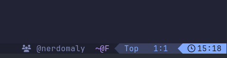

# lualine-codeowners.nvim

Show the CODEOWNERS team for the current buffer in your statusline — pure Lua, no external tools required.

## Demo



> Drop a screenshot into `docs/demo.png` to populate this.

## Requirements

- Neovim 0.10+ (`vim.uv` and `vim.fs.root`)
- A [Nerd Font](https://www.nerdfonts.com/) for the default icon, or set `icon = ""`

## Install

**lazy.nvim**
```lua
{
  "nerdomaly/lualine-codeowners.nvim",
  dependencies = { "nvim-lualine/lualine.nvim" },
  config = function()
    require("lualine-codeowners").setup()
  end,
}
```

**packer.nvim**
```lua
use {
  "nerdomaly/lualine-codeowners.nvim",
  requires = { "nvim-lualine/lualine.nvim" },
  config = function()
    require("lualine-codeowners").setup()
  end,
}
```

**vim-plug**
```vim
Plug 'nvim-lualine/lualine.nvim'
Plug 'nerdomaly/lualine-codeowners.nvim'
```

## Usage

Add `"codeowners"` to your lualine section:

```lua
require("lualine").setup({
  sections = {
    lualine_x = { "codeowners", "encoding", "fileformat", "filetype" },
  },
})
```

Per-component overrides:

```lua
sections = {
  lualine_x = {
    { "codeowners", max_length = 60, display_mode = "first_plus_count" },
  },
}
```

## Configuration

```lua
require("lualine-codeowners").setup({
  icon = "\u{f0c0}",              -- "" to disable icon
  icon_separator = "  ",          -- between icon and owner text
  placeholder = "no owner",       -- shown when no CODEOWNERS match
  locations = {                   -- search order for CODEOWNERS file
    "CODEOWNERS",
    ".github/CODEOWNERS",
    "docs/CODEOWNERS",
  },
  max_length = 40,                -- 0 disables truncation
  truncation_suffix = "\u{2026}", -- appended when text is truncated
  display_mode = "all",           -- "all" | "first_plus_count" | "first"
  separator = ", ",               -- separator for "all" mode
  show_placeholder_when_empty = true, -- false = return "" when no owner
})
```

## API

```lua
local co = require("lualine-codeowners")

co.get_owners(bufnr)   -- returns { "@team/foo", ... } or nil
co.get_display(bufnr)  -- returns formatted string (what the component renders)
co.reset()             -- clears all caches
```

**`:CodeownersWho`** — prints the owner(s) for the current buffer via `vim.notify`.

## Other statuslines

Any statusline can call the API directly:

```lua
-- mini.statusline
local function statusline()
  return require("lualine-codeowners").get_display()
end
```

## How it works

The plugin walks up from the current buffer's path to find a `.git` directory, then reads the first CODEOWNERS file found in the configured locations. Rules are matched in reverse order (last rule wins), following GitHub semantics.

## Credits

Prior art (unmaintained, Node.js-dependent):
- [SebastienLeonke/nvim-codeowners](https://github.com/SebastienLeonke/nvim-codeowners)
- [mrded/vim-github-codeowners](https://github.com/mrded/vim-github-codeowners)

## License

MIT
